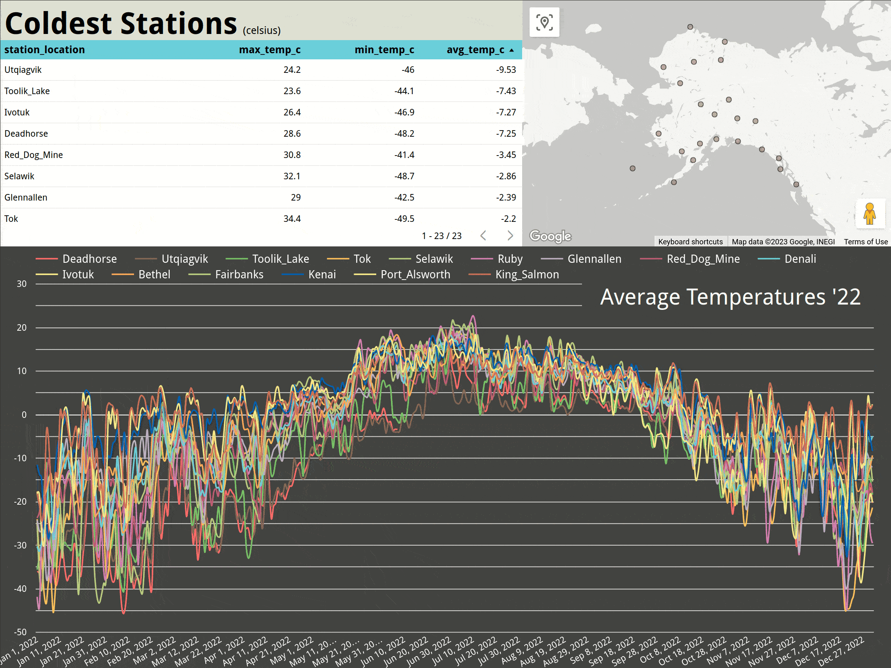
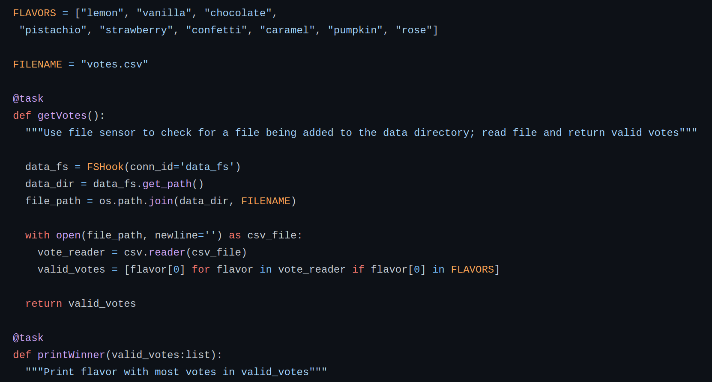
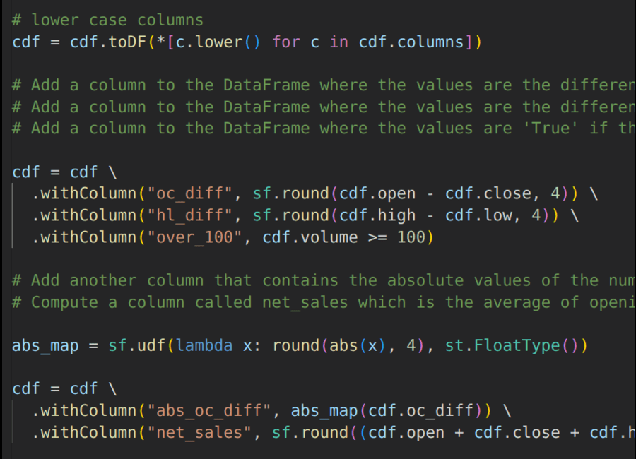

<h1 align="center">Hello There! 👋 I'm <a href="https://alexsocarras.com">Alex</a>  (Alejandro) (سكندر)   </h1>

  

### I'm a Data Engineering Fellow at [Tech Impact](https://www.techimpact.org/). 

#### I pivoted here from data analysis in public health after completing the bootcamp at [Data Stack Academy](https://datastack.academy/). 

There was also a brief window where I was sleeping out of my car going cross-country (pictured). 

Click on my name to see my personal site and resume. Check out my projects below for a sample of what I completed at the bootcamp.

---

<h2 align="center">
Python |  SQL /MySQL |  DBT |GCP |  Airflow |  Spark</h2>

---
<!-- 

  

 -->

<table style="width:600px" align="center">
  <tr>
    <td style="width:600px">
      
      <h3 align="center"><i>alaska-etl</i></h3>
    </td>
    <td style="width:800px">
      
      <h3 align="center"><i>city-crime</i></h3>
    </td>
    <td style="width:600px">
      
      <h3 align="center"><i>airflow-review2</i></h3>
    </td>
    <td style="width:600px">
      
      <h3 align="center"><i>spark-review</i></h3>
    </td>
  </tr>
</table>

<!-- **apsocarras/apsocarras** is a ✨ _special_ ✨ repository because its `README.md` (this file) appears on your GitHub profile.

Here are some ideas to get you started:

- 🔭 I’m currently working on ...
- 🌱 I’m currently learning ...
- 👯 I’m looking to collaborate on ...
- 🤔 I’m looking for help with ...
- 💬 Ask me about ...
- 📫 How to reach me: ...
- 😄 Pronouns: ...
- ⚡ Fun fact: ... -->
