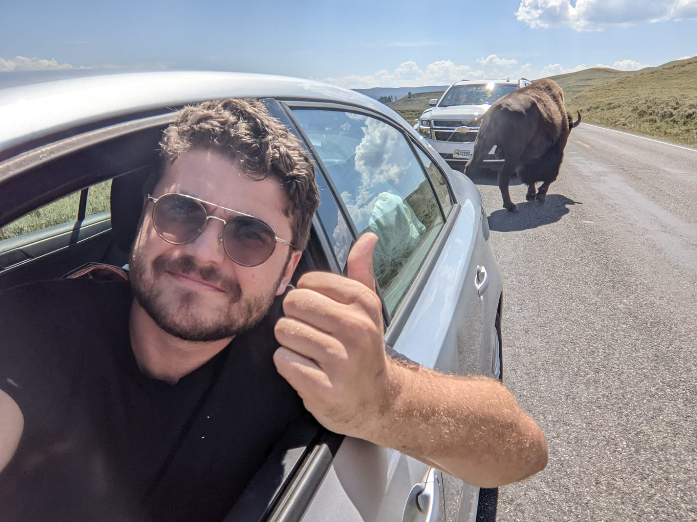

## Hello there! 👋 I'm [Alejandro](http://alexsocarras.com/). 

I'm a rising graduate of the Data Engineering Program at [Epicodus](https://www.epicodus.com/), headed by the folks at [Data Stack Academy](https://www.datastack.academy/). Here you can check out some of the projects I've been working on, using Python, SQL, DBT, Google Cloud, and BigQuery. Right now we're learning Airflow and Spark.

<!--
**apsocarras/apsocarras** is a ✨ _special_ ✨ repository because its `README.md` (this file) appears on your GitHub profile.

Here are some ideas to get you started:

- 🔭 I’m currently working on ...
- 🌱 I’m currently learning ...
- 👯 I’m looking to collaborate on ...
- 🤔 I’m looking for help with ...
- 💬 Ask me about ...
- 📫 How to reach me: ...
- 😄 Pronouns: ...
- ⚡ Fun fact: ...
-->
